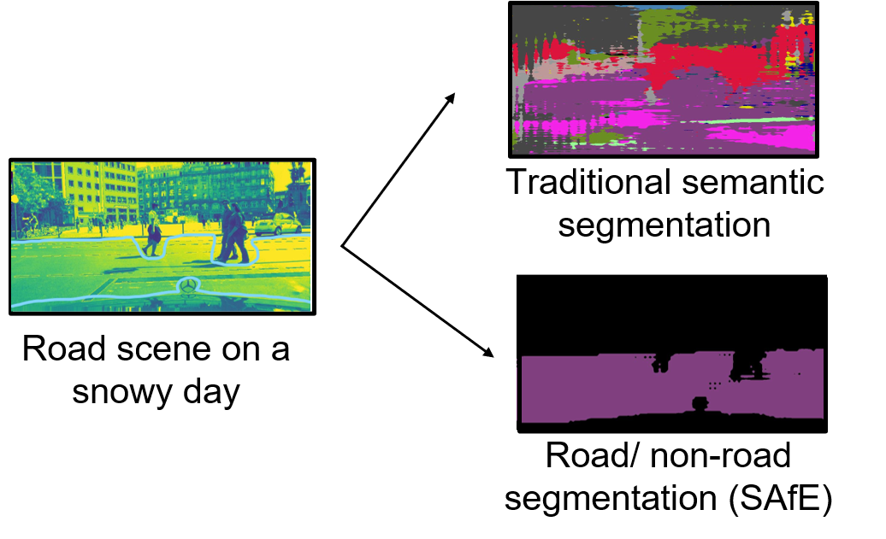
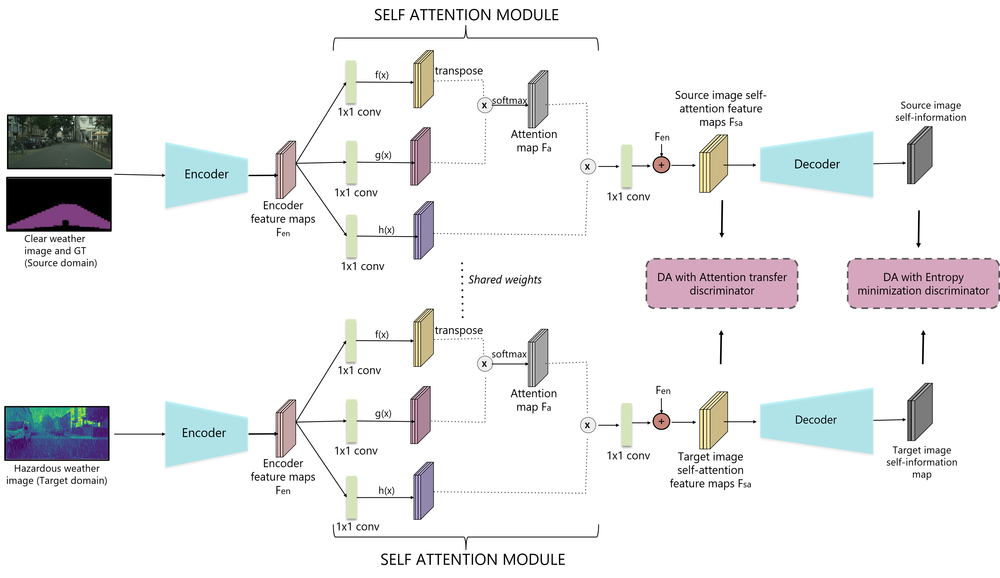

### Paper - [**SS-SFDA: Semi Supervised Source Free Domain Adaptation for Road Segmentation for Road Segmentation in Hazardous Environments**](https://arxiv.org/abs/2012.08939)

Project Page - https://gamma.umd.edu/researchdirections/autonomousdriving/weathersafe/ 


<!---->

Watch the entire video [*here*](https://youtu.be/rSPIah0liTA)


Please cite our paper if you find it useful.

```
@article{kothandaraman2020ss,
  title={SS-SFDA: Self-Supervised Source-Free Domain Adaptation for Road Segmentation in Hazardous Environments},
  author={Kothandaraman, Divya and Chandra, Rohan and Manocha, Dinesh},
  journal={arXiv preprint arXiv:2012.08939},
  year={2020}
}
```

<p align="center">

</p>

Table of Contents
=================
 * [Paper - <a href="link to paper" rel="nofollow"><strong>SS-SFDA: Semi Supervised Source Free Domain Adaptation for Road Segmentation for Road Segmentation in Hazardous Environments</strong></a>](#paper---SS-SFDA-Semi-Supervised-Source-Free-Domain-Adaptation-for-Road-Segmentation-for-Road-Segmentation-in-Hazardous-Environments)
  * [**Repo Details and Contents**](#repo-details-and-contents)
     * [Code structure](#code-structure)
     * [Testing a pretrained model](#testing-a-pretrained-model)
     * [Training your own model](#training-your-own-model)
     * [Datasets](#datasets)
     * [Dependencies](#dependencies)
  * [**Our network**](#our-network)
  * [**Acknowledgements**](#acknowledgements)

## Repo Details and Contents
Python version: 3.7

### Code structure
#### Dataloaders <br>
|Dataset|Dataloader|List of images|
|-----|-----|-----|
|Clear weather CityScapes|dataset/cityscapes.py|dataset/cityscapes_list (train_images, val_images, train_labels, val_images)|
|Synthetic Fog| dataset/cityscapes_fog.py | dataset/cityscapes_list (train_rain_fog, val_rain_fog) |
|Synthetic Rain | dataset/cityscapes_rain.py | dataset/cityscapes_list (train_rain_fog, val_rain_fog) |
|Synthetic Rain | dataset/cityscapes_rain.py | dataset/cityscapes_list (train_rain_fog, val_rain_fog) |
|Real Fog - Foggy Zurich| dataset/foggy_zurich/train(test).py | dataset/foggy_zurich/lists_file_names  |
|Real, Night Driving - Dark Zurich | dataset/dark_zurich/train(test).py | dataset/dark_zurich/lists_file_names  |
|Heterogeneous Real, Rain + Night - Raincouver | dataset/raincouver/raincouver.py | dataset/raincouver (train_rain_fog, val_rain_fog) |
|Heterogeneous Real, Berkeley Deep Drive | dataset/bdd/bdd_{train,val}.py | dataset/bdd/bdd_list |

#### Models
model/drnd38.py - DRN-D-38 model <br>
model/drnd38_attention.py - DRN-D-38 model with self-attention

### Pretrained models

The pretrained models can be found [here](https://drive.google.com/drive/folders/1rHv6BUHPIsB-sGTux9mB01RSbBCskmQO?usp=sharing). Use eval.py to test them.

### Our network
<p align="center">

</p>

### Training your own model

**Stage 1**: The network is pre-trained on a clear weather dataset such as CityScapes. Use the code train_stage1.py. <br>

**Stage 2**: Divide the entire dataset into minibatches and arrange in the increasing order of intensity (of rain/fog/snow/light). For minibatch, optimize the network in two steps using train_stage2step1.py and train_stage2step3.py. At each minibatch, remember to initialize the network with weights obtained from the previous minibatch of training. For the first minibatch, the network is initialized with weights from stage 1.

**Stage 3**: For heterogeneous real datasets, pick a small subset of images (of the order of 5-10), and finetune the network trained in stage 2 using train_stage3.py.

**Evaluation**: Use eval.py

### Datasets
* [**Clear weather: CityScapes**](https://www.cityscapes-dataset.com/) 
* [**Synthetic: Rain and Fog**](https://team.inria.fr/rits/computer-vision/weather-augment/)  
* [**Real dataset (night): Dark Zurich**](https://www.trace.ethz.ch/publications/2019/GCMA_UIoU/)
* [**Real dataset (fog): Foggy Zurich**](http://people.ee.ethz.ch/~csakarid/Model_adaptation_SFSU_dense/)
* [**Heterogeneous Real dataset (rain+night): Raincouver**](https://www.cs.ubc.ca/~ftung/raincouver/index.html) 
* [**Heterogeneous Real dataset (multiple weather, lighting conditions): Berkeley Deep Drive**](https://bdd-data.berkeley.edu/) 


### Dependencies
PyTorch <br>
NumPy <br>
SciPy <br>
Matplotlib <br>


## Acknowledgements

This code is heavily borrowed from [**AdaptSegNet**](https://github.com/wasidennis/AdaptSegNet), and [**SAGAN**](https://github.com/heykeetae/Self-Attention-GAN)

